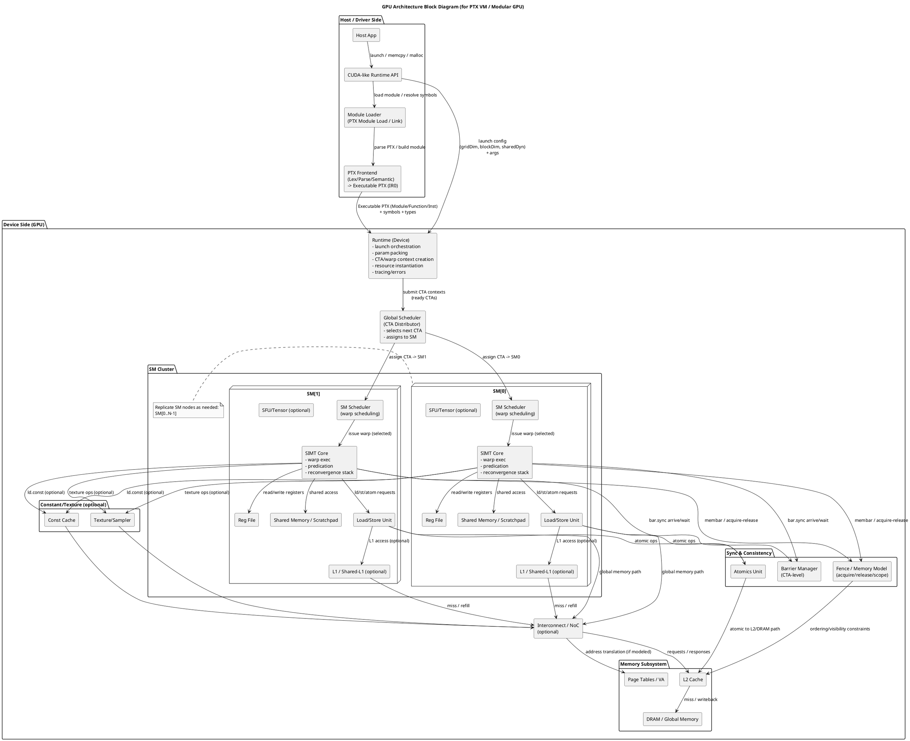

# ProtoGPU

> Chinese version: [README.zh-CN.md](README.zh-CN.md)

## Overview

This project implements a **semantic GPU execution framework** capable of executing CUDA and PTX programs without requiring a cycle-accurate microarchitectural model.

The system provides configurable GPU instruction definitions and modular hardware abstractions, together with a CUDA compatibility shim that enables seamless integration with CUDA C programs.

New instructions can be rapidly prototyped by mapping them to existing **IR operations**, which are internally expanded into a sequence of micro-operations executed by the SIMT semantic engine. This mechanism allows fast validation of instruction semantics and integration feasibility during the **pre-silicon design stage**.

## Features

- Configurable instruction set (data-driven ISA)
  - The mapping from PTX instruction shape (`ptx_opcode/type_mod/operand_kinds`) to internal IR ops is driven by the `--ptx-isa` JSON (example: `assets/ptx_isa/demo_ptx64.json`).
  - IR op execution semantics are driven by the `--inst-desc` JSON (example: `assets/inst_desc/demo_desc.json`), making it easy to continuously extend via an “incremental coverage matrix”.
  - Entry doc: `docs/doc_user/cli.md`.

- Micro-op (µop) composition and execution
  - Instruction execution is expanded into micro-ops (Exec/Control/Mem) based on descriptor files and executed by basic execution units; the SIMT core orchestrates warp masks, predication, divergence/reconvergence, and related control.
  - Design overview: `docs/doc_design/arch_design.md`.

- Configurable hardware architecture (replaceable/composable modules)
  - Key “swappable points” from the hardware block diagram are implemented as configurable software modules (schedulers / memory model / parallel execution mode, etc.), so different profiles can be composed by configuration changes.
  - User entry: `docs/doc_user/modular_hw_sw_mapping.md`.

- Current external baseline: PTX 6.4 + sm_70 (functional level)
  - Uses PTX 6.4 (frozen subset) and an sm70 profile as the bring-up and regression anchor; the memory baseline is No-cache + address space classification (global/shared/local/const/param).
  - Examples and notes: `cuda/demo/README.zh-CN.md`.

- CUDA Runtime shim: run clang-compiled CUDA demos on ProtoGPU
  - Via a `libcudart.so.12`-compatible shim, a clang-compiled `.cu` demo host binary is redirected at runtime into the ProtoGPU runtime (currently primarily targeting Linux/WSL paths).
  - User guide: `cuda/docs/doc_user/cuda-shim.md`.

## Architecture

Source: [docs/doc_spec/gpu_block_diagram.puml](docs/doc_spec/gpu_block_diagram.puml)




## Quick Start

### 1. Build

From the repo root:

```bash
cmake -S . -B build -G Ninja -DCMAKE_BUILD_TYPE=Release
cmake --build build
```

Script alternative:

```bash
bash scripts/build_all.sh build Release
```

More details: `cuda/docs/doc_build/cuda-shim-build.md`, `docs/doc_user/scripts.md`.

### 2. Run the CLI

`gpu-sim-cli` is the minimal runnable entry point. A typical run is:

```bash
./build/gpu-sim-cli \
  --ptx assets/ptx/demo_kernel.ptx \
  --ptx-isa assets/ptx_isa/demo_ptx64.json \
  --inst-desc assets/inst_desc/demo_desc.json \
  --config assets/configs/demo_config.json \
  --grid 1,1,1 \
  --block 32,1,1 \
  --trace out/trace.jsonl \
  --stats out/stats.json
```

For the kernel I/O path:

```bash
./build/gpu-sim-cli --ptx assets/ptx/write_out.ptx --io-demo
```

More details: `docs/doc_user/cli.md`.

### 3. Embed as a C++ library

If you want to call ProtoGPU from your own C++ program, use the public runtime API in `include/gpusim/runtime.h`.

- File-path entry points mirror the CLI.
- In-memory entry points accept PTX text and JSON asset text directly.
- Runtime helpers include host/device allocation and H2D/D2H copies.

More details: `docs/doc_user/public_api.md`.

### 4. Run the CUDA shim demo

On Linux/WSL, run the prebuilt CUDA demo binary against ProtoGPU by pointing the dynamic loader at the repo-built `libcudart.so.12` shim:

```bash
export LD_LIBRARY_PATH="$PWD/build:${LD_LIBRARY_PATH}"
export GPUSIM_CUDART_SHIM_LOG=1
./cuda/demo/demo
```

You can also override the default embedded assets:

```bash
export GPUSIM_CONFIG=$PWD/assets/configs/demo_config.json
export GPUSIM_PTX_ISA=$PWD/assets/ptx_isa/demo_ptx64.json
export GPUSIM_INST_DESC=$PWD/assets/inst_desc/demo_desc.json
```

More details: `cuda/docs/doc_user/cuda-shim.md`, it introduces how to build your .cu to be executable, how to generate PTX file from your .cu, how to run the executable generated by your .cu with this cuda shim library.

### 5. Run regression scripts

Unit tests:

```bash
bash scripts/run_unit_tests.sh build
```

Integration tests:

```bash
bash scripts/run_integration_tests.sh build
```

More details: `docs/doc_user/scripts.md`.


## Documentation

All documents are organized under `docs/`:

- docs/doc_build/
  - Build and release documentation (e.g., how to build the docs site, documentation generation scripts, artifact directory conventions).

- docs/doc_design/
  - Architecture and module design (abstract logic layer).
  - Includes overall architecture notes and module relationship diagrams (PlantUML) used to define module boundaries, responsibilities, flows, and interface contracts.
  - Typical contents: architecture design, module layering, key data structures/contracts, end-to-end sequence diagrams.

- docs/doc_dev/
  - Implementation-facing design and conventions that guide code development (implementation layer).
  - Typical contents: code directory conventions, module landing plans, class/file split, coding conventions, debugging and development workflows.

- docs/doc_plan/
  - Planning and roadmap (planning layer).
  - Used to track design/development plans, task breakdown, acceptance criteria, etc.
  - Subdirectory convention:
    - docs/doc_plan/plan_design/: plans and breakdown for abstract design phase (module design order, alignment checklists, etc.).
    - docs/doc_plan/plan_dev/: plans and breakdown for code development phase.
    - docs/doc_plan/plan_test/: plans and breakdown for test design and implementation phase.

- docs/doc_spec/
  - Deterministic descriptions of the target hardware; the simulator is implemented against these descriptions to ensure real practical value.

- docs/doc_tests/
  - Test design and test case documentation, including guidance for writing test code.
  - Typical contents: test strategy, golden trace conventions, regression test list, verification methods and coverage scope.

- docs/doc_user/
  - User-facing documentation (User Guide).
  - Typical contents: how to run/use tools, CLI/configuration, examples, FAQ.

## Conventions

- Architecture and module relationships follow the PUML diagrams under docs/doc_design; if the text conflicts with diagrams, diagrams win.
- “Abstract logic design” lives in docs/doc_design / docs/doc_plan; “guidance for code development” lives in docs/doc_dev.

## Code and test directory structure

- src/
  - Root of functional code; module boundaries and dependency directions follow PUML diagrams in docs/doc_design.
  - Subdirectories align with PUML packages: common/frontend/instruction/runtime/simt/units/memory/observability/apps.

- tests/
  - Root of test code.
  - unit/: single-module tests.
  - integration/: end-to-end integration path tests (runtime→engines→simt→units→memory→observability).
  - golden/: golden traces and expected results.
  - fixtures/: test inputs (PTX, descriptor JSON, configs).

- assets/
  - Input data assets for running and regression.
  - ptx/: example PTX.
  - inst_desc/: instruction descriptor JSON datasets.

- schemas/
  - Schemas for structured data (e.g., inst_desc.schema.json).

- tools/
  - Helper tools (e.g., trace viewer, data generators).

- scripts/
  - Local helper scripts (build/run/test/format, etc.).

## Contributing

Contributions are welcome! Kindly please be noted that part of this document is generated by AI tools, if there are any mistake kindly please leaving comments.

## License

Source code and other non-documentation repository contents are licensed under the Apache License 2.0. See the [LICENSE](LICENSE) file for details.

Documentation content under `blog/`, `docs/`, and `cuda/docs/` is separately licensed under CC BY 4.0. See [blog/LICENSE](blog/LICENSE), [docs/LICENSE](docs/LICENSE), and [cuda/docs/LICENSE](cuda/docs/LICENSE).
